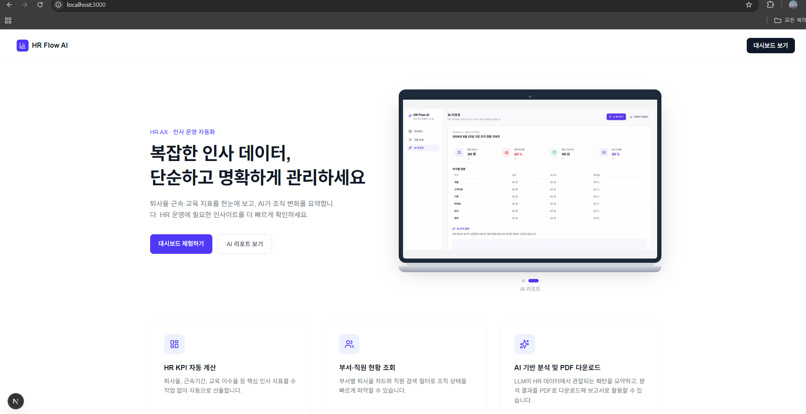
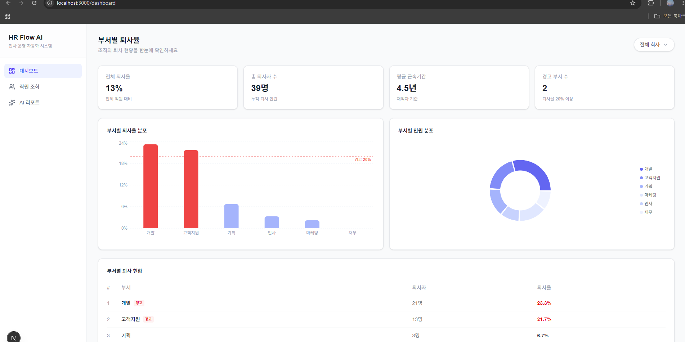
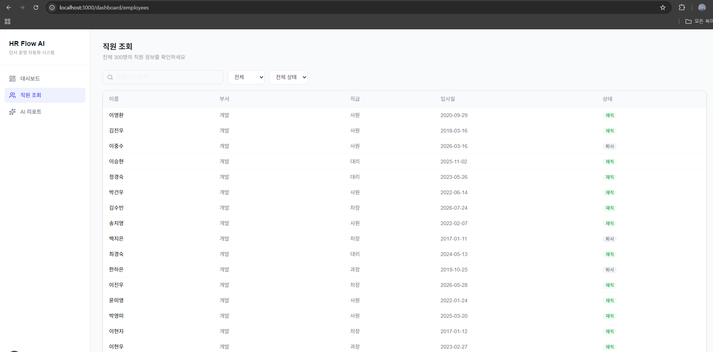
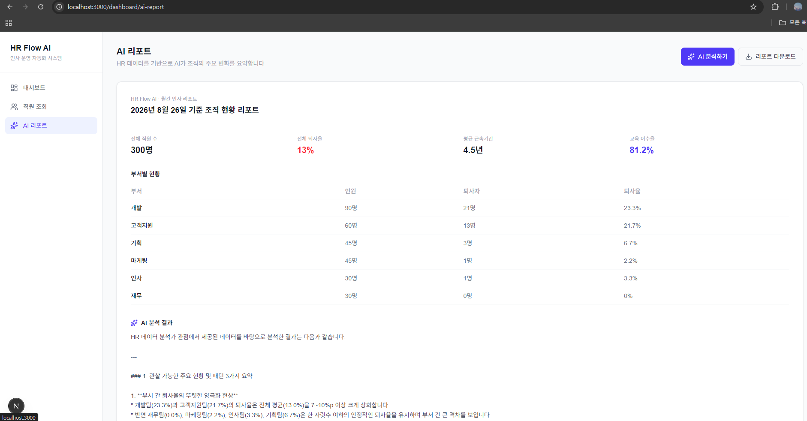
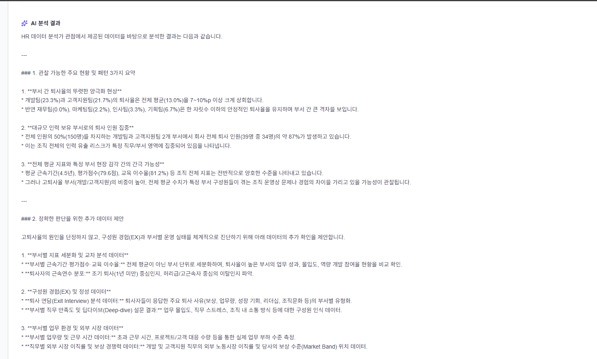
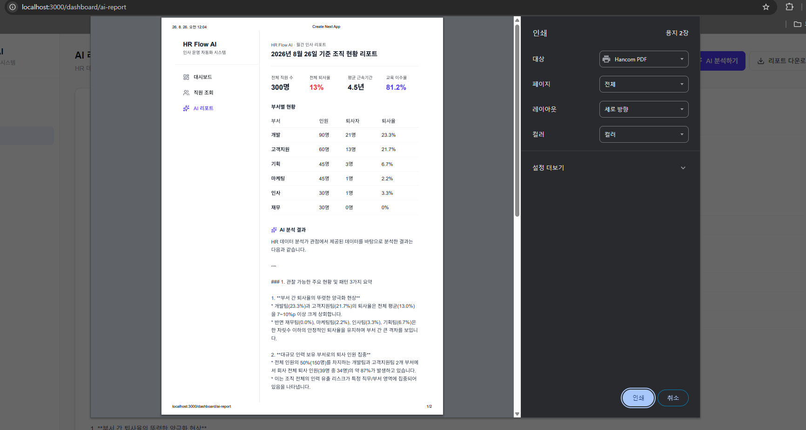

# HR Flow AI

**AI 기반 HR 운영 데이터 분석 및 업무 자동화 시스템**

반복적인 HR 운영 업무를 자동화하고, 인사 데이터를 기반으로 조직의 변화를 빠르게 파악할 수 있도록 지원하는 HR AX(AI Transformation) 프로젝트입니다.

> 본 프로젝트는 개인정보 보호를 위해 실제 데이터가 아닌 가상의 HR 데이터를 생성하여 사용했습니다.

---

## 목차

1. [프로젝트 소개](#1-프로젝트-소개)
2. [핵심 기능](#2-핵심-기능)
3. [시스템 아키텍처](#3-시스템-아키텍처)
4. [기술 스택](#4-기술-스택)
5. [DB 설계](#5-db-설계)
6. [프로젝트 구조](#6-프로젝트-구조)
7. [실행 방법](#7-실행-방법)
8. [API 목록](#8-api-목록)
9. [프로젝트 한계 및 향후 개선](#9-프로젝트-한계-및-향후-개선)
10. [개발 과정에서 배운 점](#10-개발-과정에서-배운-점-트러블슈팅-요약)
11. [라이선스](#11-라이선스)
12. [작성자](#12-작성자)

---

## 1. 프로젝트 소개

기존 HR 운영 업무는 아래와 같은 흐름으로 진행되는 경우가 많습니다.

직원 데이터 수집 → Excel 정리 → 데이터 취합 → 부서별 통계 계산 → 보고서 작성 → 담당자의 수작업 분석

이 프로젝트는 위 과정을 아래와 같이 자동화합니다.

```
직원 데이터(DB) → Python 자동 분석 → HR KPI 자동 계산 → Dashboard 시각화 → AI 분석/요약 → 리포트 생성 → HR 담당자 의사결정 지원

**핵심 목표**는 HR 담당자가 데이터를 정리하는 데 드는 시간을 줄이고, 조직의 변화를 빠르게 파악할 수 있도록 지원하는 것입니다.

### Demo

시연 영상은 아래 링크에서 확인할 수 있습니다.
```
[시연 영상 보기](https://www.youtube.com/watch?v=PJrsocMxa0Y)




---

## 2. 핵심 기능

### 2-1. HR KPI 자동 계산 및 대시보드
Python/Pandas로 핵심 인사 지표를 자동 계산합니다. 대시보드 상단 카드에는 **전체 퇴사율, 총 퇴사자 수, 평균 근속기간, 경고 부서 수(퇴사율 20% 이상)** 를 보여 주고, 퇴사율 20% 이상인 부서는 경고 뱃지와 기준선으로 시각적으로 강조합니다.

전체 직원 수·평균 평가점수·교육 이수율 등은 API에서 함께 계산되며, AI 리포트 화면에서 확인할 수 있습니다.

**동작 방식**: 대시보드 접속(또는 새로고침) 시마다 Flask가 MariaDB에서 최신 데이터를 조회하고, Pandas가 그 자리에서 KPI를 다시 계산해 반환합니다. 별도로 계산 결과를 저장해두지 않고 매 요청마다 실시간으로 계산하는 방식이라, 담당자가 데이터를 수작업으로 재집계하지 않아도 항상 최신 상태의 지표를 확인할 수 있습니다.

**HR KPI 선정 기준**: 본 프로젝트에서는 HR 담당자가 조직 현황을 빠르게 파악하기 위해 자주 활용할 수 있는 대표적인 조직 운영 지표를 중심으로 KPI를 구성했습니다.

| 지표 | 선정 이유 | 표시 위치 |
|---|---|---|
| 퇴사율 / 퇴사자 수 / 경고 부서 수 | 조직 변화와 인력 이탈 추이 확인 | 대시보드 카드 |
| 평균 근속기간 | 조직 안정성 확인 | 대시보드 카드 |
| 직원 수 | 조직 규모와 부서별 인력 현황 파악 | 부서 표·도넛 / AI 리포트 |
| 평균 평가점수 | 구성원 성과 변화 파악 | AI 리포트 |
| 교육 이수율 | 구성원 성장 및 교육 운영 현황 확인 | AI 리포트 |

해당 지표는 실제 기업의 모든 HR KPI를 의미하지 않으며, 프로젝트 목적에 맞춰 가상의 HR 데이터를 기반으로 구성한 예시입니다. 실제 조직에서는 기업의 인사 정책과 조직 특성에 따라 지표와 기준값이 달라질 수 있습니다.



### 2-2. 부서별 현황 시각화
부서별 퇴사율(막대 차트)과 인원 분포(도넛 차트), 부서별 퇴사 현황 표를 통해 조직 상태를 직관적으로 파악할 수 있습니다. (위 대시보드 스크린샷에 포함)

### 2-3. 직원 정보 조회
이름 검색, 부서/재직 상태 필터를 통해 필요한 직원 정보를 빠르게 조회할 수 있습니다.



### 2-4. AI 기반 조직 분석 및 리포트 생성
버튼 클릭 한 번으로 LLM(Gemini)이 현재 HR KPI 데이터를 분석하여, 관찰 가능한 주요 변화 3가지와 추가로 확인이 필요한 데이터를 제안합니다. 분석 결과는 리포트 형태로 정리되며, 브라우저 인쇄 기능(`window.print()`)을 활용해 PDF로 저장할 수 있습니다.

**AI 분석 시 적용한 원칙:**
- 데이터에서 관찰되는 패턴만 서술하고, 원인을 단정적으로 판단하지 않음
- 상관관계를 인과관계처럼 표현하지 않음
- 구성원 경험(Employee Experience)과 조직 운영 관점에서 서술

> AI는 반복적인 데이터 분석과 리포트 작성을 지원할 뿐, HR 담당자를 대신해 조직 문제의 원인을 판단하지 않습니다. 최종적인 해석과 의사결정은 HR 담당자가 수행할 수 있도록, AI는 관찰된 패턴과 추가로 확인이 필요한 데이터를 함께 제시하는 방식으로 설계했습니다.





분석이 완료되면 **리포트 다운로드** 버튼으로 인쇄 대화상자를 열고, PDF로 저장할 수 있습니다.



---

## 3. 시스템 아키텍처

```
[MariaDB]
   │  employees / departments / attendance / evaluations / training
   ▼
[Python/Pandas] ── KPI 계산 (kpi.py)
   │
   ▼
[Flask API] ── /api/kpi, /api/employees, /api/ai-summary
   │                                   │
   │                                   ▼
   │                          [Gemini API] AI 분석
   ▼
[Next.js Frontend]
   ├─ /                    랜딩 페이지
   ├─ /dashboard           KPI 대시보드
   ├─ /dashboard/employees 직원 조회
   └─ /dashboard/ai-report AI 리포트 (+ 인쇄/PDF 저장)
```

데이터베이스에 저장된 가상 HR 데이터를 Pandas로 가공해 KPI를 계산하고, 이를 Flask REST API로 노출한 뒤, Next.js 프론트엔드에서 시각화 및 AI 분석 요청을 처리하는 구조입니다.

---

## 4. 기술 스택

### Frontend
- React, Next.js (App Router)
- TypeScript
- Tailwind CSS
- Recharts (차트 시각화)

### Backend
- Python, Flask
- Flask-CORS

### Database
- MariaDB
- PyMySQL

### Data / AI
- Pandas (KPI 계산)
- Faker (가상 데이터 생성)
- Google Gemini API (AI 분석)

### 기타
- Git / GitHub

---

## 5. DB 설계

가상의 직원 약 300명을 대상으로 5개 테이블을 설계했습니다. 실제 개인정보는 사용하지 않았습니다.

```
departments (1) ──< employees (1) ──< attendance
                            │
                            ├──< evaluations
                            │
                            └──< training
```

| 테이블 | 설명 |
|---|---|
| `departments` | 부서 마스터 정보 (개발/기획/마케팅/인사/재무/고객지원) |
| `employees` | 직원 기본 정보 (이름, 부서, 직급, 입사일, 재직 상태 등) |
| `attendance` | 근태 기록 (최근 1개월 영업일 기준) |
| `evaluations` | 평가 기록 (직원별 1~3회) |
| `training` | 교육 이수 기록 (직원별 1~3개 과정) |

`employees`가 중심이 되며, `departments`를 참조(FK)하고, `attendance`/`evaluations`/`training`이 각각 `employees`를 참조하는 1:N 구조입니다. 직원 개인의 변하지 않는 정보(`employees`, `departments`)와, 시간에 따라 반복적으로 쌓이는 이력 정보(`attendance`, `evaluations`, `training`)를 분리하여 설계했습니다.

가상 데이터는 아래와 같은 기준으로 생성했습니다.
- 부서별 인원 비중을 다르게 설정 (개발 30%, 고객지원 20%, 기획/마케팅 각 15%, 인사/재무 각 10%)
- 부서별 퇴사율에 편차를 두어, 실제 조직에서 나타날 수 있는 "특정 부서 집중 이탈" 패턴을 재현
- 최근 1년 이내 입사자 비중을 일부 높여, "신규 입사자 조기 이탈" 관찰이 가능하도록 구성

테이블 생성 SQL은 [`docs/schema.sql`](./docs/schema.sql)을 참고하세요.

---

## 6. 프로젝트 구조

```
HR/
├── .gitignore
├── LICENSE
├── README.md
├── docs/
│   ├── schema.sql                    # DB 테이블 생성 SQL
│   └── images/                       # README 스크린샷 / demo.gif
│
├── backend/                          # Flask API + 데이터 처리
│   ├── .env                          # DB·Gemini API 키 (gitignore)
│   ├── .env.example                  # 환경변수 키 예시
│   ├── requirements.txt              # Python 패키지 목록
│   ├── app.py                        # Flask 서버, API 라우트
│   ├── db.py                         # MariaDB(MySQL 호환) 연결
│   ├── kpi.py                        # KPI 집계 로직
│   ├── ai_summary.py                 # Gemini AI 요약
│   └── seed_data.py                  # 더미 데이터 생성
│
└── frontend/                         # Next.js 프론트엔드
    ├── package.json
    ├── next.config.ts
    ├── tsconfig.json
    │
    ├── public/                       # 정적 파일
    │   ├── dashboard-preview.png     # 랜딩 미리보기 (대시보드)
    │   └── ai-Image.png              # 랜딩 미리보기 (AI 리포트)
    │
    ├── components/
    │   └── LaptopPreview.tsx         # 랜딩 노트북 + 이미지 캐러셀
    │
    └── app/
        ├── layout.tsx                # 루트 레이아웃
        ├── globals.css               # 전역 스타일
        ├── page.tsx                  # 랜딩(홈) 페이지
        │
        └── dashboard/
            ├── layout.tsx            # 사이드바 레이아웃
            ├── page.tsx              # 대시보드 (KPI·차트)
            ├── employees/
            │   └── page.tsx          # 직원 조회
            └── ai-report/
                └── page.tsx          # AI 리포트
```

### 주요 파일 역할

| 구분 | 파일 | 역할 |
|---|---|---|
| Backend | `app.py` | `/api/kpi`, `/api/ai-summary`, `/api/employees` 등 API 라우트 |
| Backend | `db.py` | MariaDB(MySQL 호환) 접속 |
| Backend | `kpi.py` | 퇴사율·근속·부서별 지표 계산 |
| Backend | `ai_summary.py` | LLM 기반 조직 분석 요약 |
| Backend | `seed_data.py` | departments/employees 등 가상 데이터 생성 |
| Frontend | `app/page.tsx` | 랜딩 페이지 |
| Frontend | `dashboard/page.tsx` | 부서별 퇴사율 대시보드 |
| Frontend | `employees/page.tsx` | 직원 검색·필터 조회 |
| Frontend | `ai-report/page.tsx` | AI 분석 및 리포트 인쇄/PDF 저장 |
| Frontend | `LaptopPreview.tsx` | 홈 화면 노트북 미리보기 컴포넌트 |

---

## 7. 실행 방법

### 사전 준비
- Python 3.10 이상
- Node.js 18 이상
- MariaDB
- Google Gemini API 키 ([Google AI Studio](https://aistudio.google.com)에서 무료 발급 가능)

### 1) 저장소 클론
```bash
git clone https://github.com/bommolsun-droid/hr-flow.git
cd hr-flow
```

### 2) 데이터베이스 준비
MariaDB에서 데이터베이스를 생성한 뒤, [`docs/schema.sql`](./docs/schema.sql)을 실행해 5개 테이블을 생성합니다.

```bash
# 예시 (DB 이름·계정은 환경에 맞게 변경)
mysql -u root -p -e "CREATE DATABASE hr_flow CHARACTER SET utf8mb4;"

# Mac / Linux
mysql -u root -p hr_flow < docs/schema.sql

# Windows (클라이언트가 PATH에 있는 경우)
mysql -u root -p hr_flow < docs\schema.sql
```

### 3) 백엔드 설정 및 실행
```bash
cd backend
python -m venv venv

# Windows
venv\Scripts\activate

# Mac / Linux
# source venv/bin/activate

pip install -r requirements.txt
```

`backend/.env.example`을 복사해 `.env`를 만든 뒤 값을 채웁니다.

```bash
# Mac / Linux
cp .env.example .env

# Windows
copy .env.example .env
```

`.env`에 채울 키는 다음과 같습니다. (비밀번호·API 키는 저장소에 올리지 마세요.)

```
DB_HOST=127.0.0.1
DB_PORT=3306
DB_USER=root
DB_PASSWORD=
DB_NAME=hr_flow
GEMINI_API_KEY=
```

가상 데이터 생성 및 서버 실행:

```bash
python seed_data.py   # 최초 1회 (이미 데이터가 있으면 생성 건너뜀)
python app.py         # Flask 서버 실행 (http://127.0.0.1:5000)
```

### 4) 프론트엔드 설정 및 실행
```bash
cd ../frontend
npm install
npm run dev            # http://localhost:3000
```

### 5) 접속
브라우저에서 `http://localhost:3000` 접속 후 대시보드를 확인합니다.

---

## 8. API 목록

Flask 서버 기본 주소: `http://127.0.0.1:5000`

| Method | Endpoint | 설명 | 사용 화면 |
|---|---|---|---|
| GET | `/api/kpi` | 전체·부서별 KPI 집계 | 대시보드 |
| GET | `/api/employees` | 직원 목록 (부서 조인) | 직원 조회 |
| GET | `/api/ai-summary` | KPI + Gemini 분석 텍스트 | AI 리포트 |

---

## 9. 프로젝트 한계 및 향후 개선

### 한계
- 실제 HR 데이터가 아닌 가상 데이터를 사용했습니다.
- 현재 데이터만으로는 퇴사 원인을 인과관계로 판단할 수 없습니다.
- 실제 서비스 적용 시 개인정보 보호 및 접근 권한 관리가 별도로 고려되어야 합니다.
- AI 분석 결과는 참고용이며, 정확성에 대한 별도 검증이 필요합니다.
- 실제 HRIS(인사정보시스템)와 연동되어 있지 않습니다.

### 향후 개선 방향

**1. 성능 및 확장성 개선**
현재는 API 요청이 들어올 때마다 전체 데이터를 조회하여 실시간으로 KPI를 재계산하는 방식입니다. 300명 규모의 데이터에서는 문제가 없지만, 데이터 규모가 커질 경우(예: 수만 명, 수백만 건의 근태 기록) 아래와 같은 한계가 있을 수 있습니다.

- 매 요청마다 전체 테이블을 조회하고 처음부터 재계산하므로, 데이터가 많아질수록 응답 속도가 느려질 수 있습니다.
- 동일한 계산을 매번 반복 수행하여 서버 자원이 낭비될 수 있습니다.
- 다수의 사용자가 동시에 접속할 경우 DB에 부하가 집중될 수 있습니다.

이를 개선하기 위해 다음과 같은 방식을 고려할 수 있습니다.
- **캐싱 도입**: Redis 등을 활용해 계산 결과를 일정 시간 저장해두고, 동일 요청에 대해서는 재계산 없이 캐시된 결과를 반환
- **배치 계산 방식 전환**: 실시간 계산 대신 정기적으로(예: 매일 새벽) KPI를 미리 계산해 별도 테이블에 저장하고, 대시보드는 저장된 결과만 빠르게 조회
- **필요한 컬럼만 조회**: 현재의 `SELECT *` 대신 계산에 필요한 컬럼만 선택적으로 조회하여 부하 절감
- **페이지네이션 적용**: 직원 조회 화면 등 목록형 데이터에 페이지 단위 조회를 적용하여 대규모 데이터에서도 빠른 응답 유지

**2. 조직 리스크 탐지 고도화**
현재는 부서별 퇴사율이 임계값(20%)을 초과하는 경우 경고 뱃지로 표시하는 단순한 방식입니다. 향후에는 퇴사율뿐 아니라 근속기간, 평가점수, 초과근무, 최근 입사자 비율 등 여러 지표를 종합한 리스크 스코어를 산출하여, 부서별 위험도를 더 입체적으로 진단하는 방향으로 발전시킬 수 있습니다. 이 경우에도 리스크 스코어는 "위험 신호를 조기에 포착하기 위한 참고 지표"로 한정하고, 실제 원인 판단은 HR 담당자가 수행하는 구조를 유지해야 합니다.

**3. AI 분석 근거 표시**
현재 AI 분석 결과는 텍스트 요약 형태로만 제공됩니다. 향후에는 AI가 어떤 수치를 근거로 해당 관찰을 도출했는지(예: 해당 부서 퇴사율 vs 전체 평균, 근속기간 비교 등) 함께 제시하여, "AI가 임의로 판단한 결과"가 아니라 "데이터에 기반한 관찰"이라는 점을 더 명확히 드러낼 수 있도록 개선할 수 있습니다.

**4. HR 담당자 업무 흐름 연결**
AI 분석 결과 확인 이후 담당자가 후속 조치를 등록하고 추적할 수 있는 이슈 관리 기능(이슈명, 우선순위, 상태, 관련 지표 등)을 추가하면, 프로젝트가 "데이터를 보여주는 도구"에서 "분석 → 발견 → 대응"까지 이어지는 업무 지원 시스템으로 확장될 수 있습니다.

**5. 기능 확장**
- 실제 HRIS 시스템과의 연동
- 역할 기반 접근 제어(RBAC) 설계: 예를 들어 HR 관리자는 전체 직원 정보를, 팀 관리자는 소속 부서 정보만, 일반 사용자는 본인 정보만 조회할 수 있도록 접근 범위를 제한하는 구조. 현재는 단일 사용자 기준으로 구현되어 있으나, 실제 서비스 적용 시에는 이러한 권한 분리가 필수적입니다.
- 개인정보 비식별화 처리
- 직원 설문, 조직문화 진단 등 정성적 데이터 추가 반영
- 사내 HR 규정을 검색할 수 있는 RAG(검색 증강 생성) 기반 챗봇
- API/MCP 기반의 HR 업무 자동화 확장

---

## 10. 개발 과정에서 배운 점 (트러블슈팅 요약)

**1. 가상환경(venv) 미활성화 상태의 패키지 설치**
가상환경이 활성화되지 않은 상태에서 패키지를 설치해 전역 Python 환경에 라이브러리가 설치된 적이 있었습니다. 가상환경을 재활성화한 뒤 패키지를 다시 설치하고 `requirements.txt`를 재생성하여 프로젝트 환경을 격리했습니다.

**2. 스크립트 재실행으로 인한 데이터 중복 생성**
가상 데이터 생성 스크립트를 여러 번 실행하면서 `departments`, `employees` 데이터가 중복 생성되는 문제가 있었습니다. 이후 스크립트 실행 전 기존 데이터 개수를 확인하고, 데이터가 없을 때만 생성하도록 하는 멱등성(idempotency) 처리를 추가하여 재실행해도 안전하도록 개선했습니다.

**3. Pandas ↔ Flask 간 데이터 타입 불일치**
Pandas의 집계 연산 결과가 `numpy.float64` 등 NumPy 전용 타입으로 반환되어, Flask의 `jsonify`가 이를 JSON으로 직렬화하지 못하는 문제가 있었습니다. 반환값을 `int()`, `float()`로 명시적으로 변환하여 해결했습니다.

**4. LLM 모델 버전 변경**
개발 중 사용하던 Gemini 모델이 신규 사용자에게 더 이상 제공되지 않아 최신 모델로 교체했습니다. 외부 API를 사용할 때는 모델/버전 변경에 대응할 수 있는 구조로 설계해야 한다는 점을 확인했습니다.

**5. 브라우저 내장 기능을 활용한 실용적 구현**
리포트 다운로드(PDF) 기능을 구현할 때, 별도의 PDF 생성 라이브러리를 추가하는 대신 브라우저의 인쇄 기능(`window.print()`)과 CSS의 인쇄 전용 스타일(`print:` 클래스)을 활용했습니다. 짧은 개발 기간 안에서는 새로운 의존성을 추가하기보다 기존 기능을 활용하는 것이 더 효율적인 선택이 될 수 있다는 것을 실습을 통해 확인했습니다.

---

## 11. 라이선스

이 프로젝트는 [MIT License](./LICENSE)를 따릅니다.

---

## 12. 작성자

bommolsun-droid  
GitHub: https://github.com/bommolsun-droid
